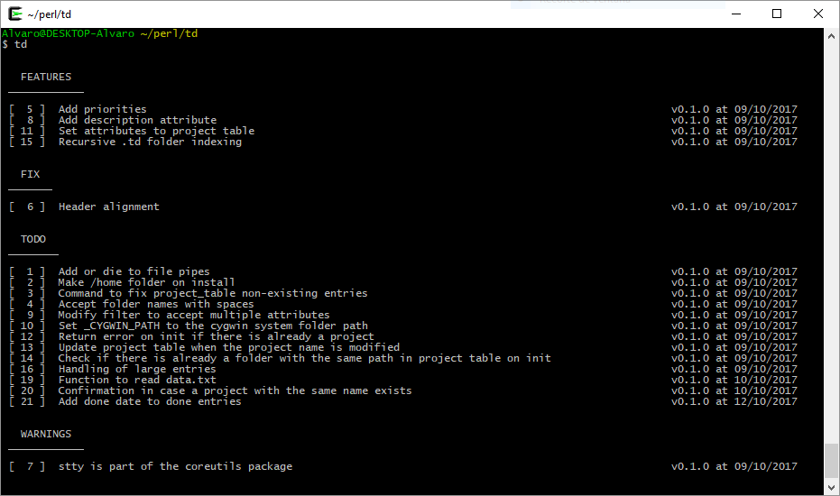

# td

Simple cygwin tool for feature and bug tracking.

# Usage

    init
        Initialize td project.

    close
        Close td project.

    add
        Add an entry to todo.txt.

        Example: td add abcd | td add abcd -t TEST | td add abcd -to efgh

    rm
        Remove entry from todo.txt

        Example: td rm 10

    done
        Either show all entries marked as down or set an entry done
        (being a special case of td set <n> s done)

        Example: td done | td done 10

    set
        Set an entry attribute (if an entry n is provided) or a global variable.

        Example: td set -version 0.1.1 | td set -n 10 -t TEST

    filter
        Filter results by entry with one arguments or by attribute with two.

        Example: td filter -e test | td filter -v 0.1.0

    list
        List all or some opened td projects

        Example: td list -all | td list -name abcd

    help
        Show this help

    version
        Show current version
